# Configuración de un Servidor Nginx con Hosts Virtuales y Directorios de Usuario

## Conexion SSH

Nos conectaremos en la máquina virtual mediante ssh para comenzar la práctica.

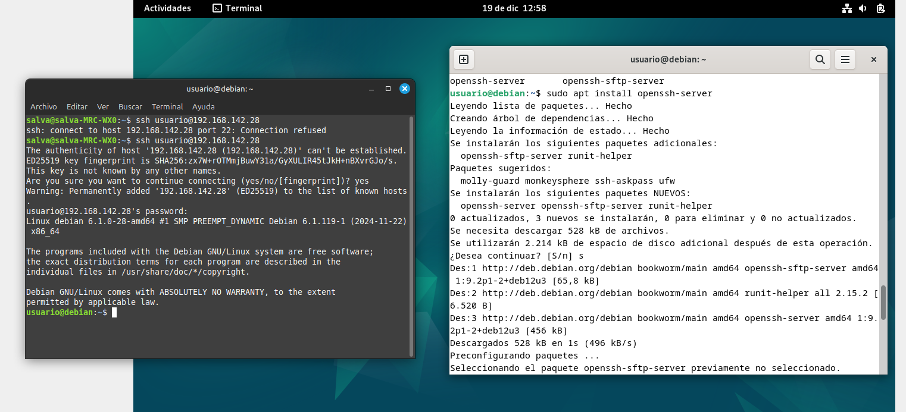

## Creacion de Usuarios

Ahora crearemos los usuarios que necesitaremos para la práctica y le damos una contraseña a cada uno.
Le añadimos -m y -s, para que se cree el directorio home y se le asigne un shell.

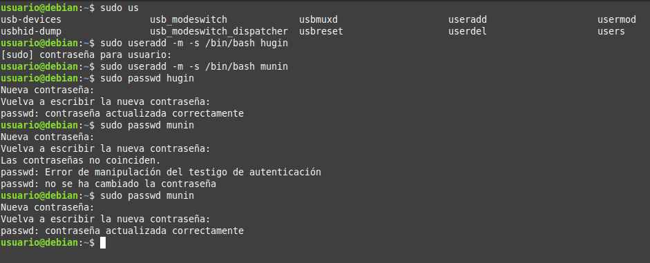

## Creación de las Carpetas public_html

Ahora crearemos las carpetas public_html en cada uno de los directorios home de los usuarios.
Para hacerlo usamos el comando su seguido del nombre de usuario y después creamos la carpeta.

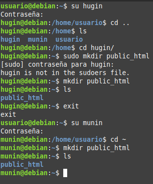

## Asignación de Permisos

Para que los usuarios public_html, cambiaremos las ACLs de los directorios public_html de cada usuario. Para ello usaremos el comando setfacl y compronbamos que se han asignado correctamente con getfacl.

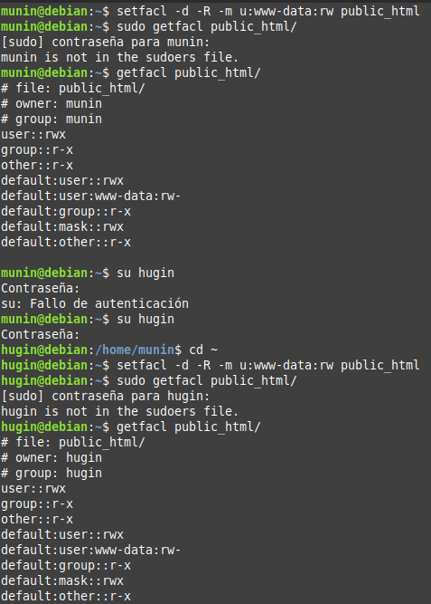

## Creación de Páginas Web Estáticas

Se creará una página web estática en cada uno de los directorios public_html de los usuarios.

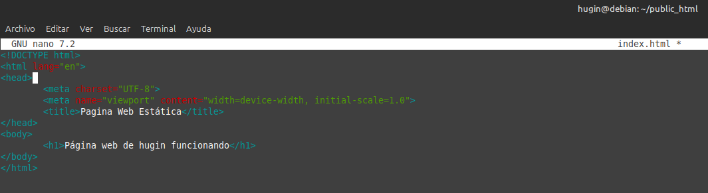

Para el otro usuario, haremos lo mismo.

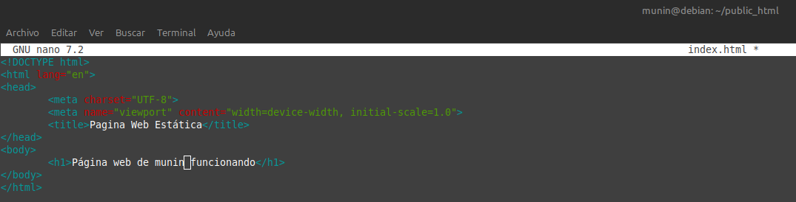

## Configuración de Nginx

Instalamos Nginx con el comando `sudo apt install nginx`.

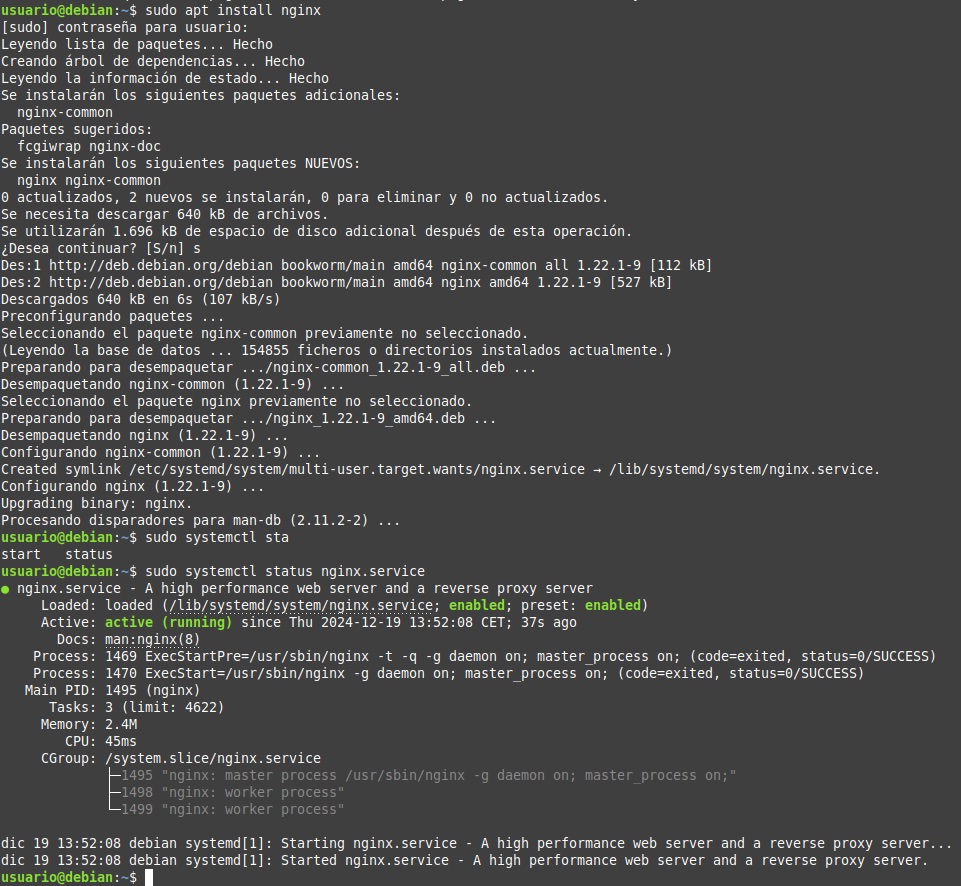

Con el comando `sudo systemctl status nginx.service` comprobamos que el servicio está activo.

## Generación de Certificados SSL

Generemos los certificados SSL

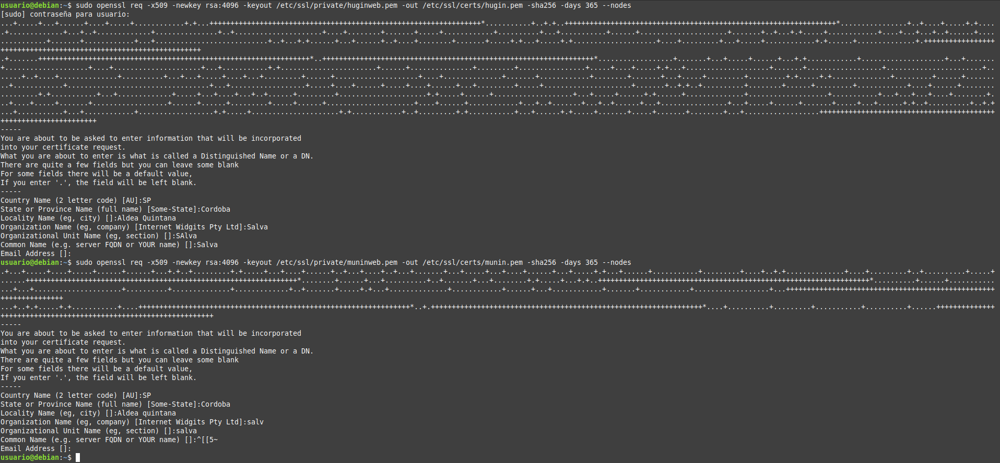

Ahora configurar los hosts virtuales en Nginx. Para ello, crearemos un archivo de configuración en la carpeta /etc/nginx/sites-available para cada uno de los usuarios.

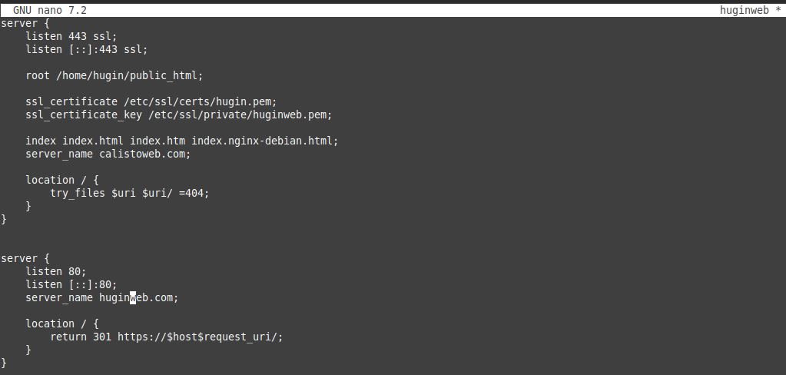

Para el otro usuario, haremos lo mismo.

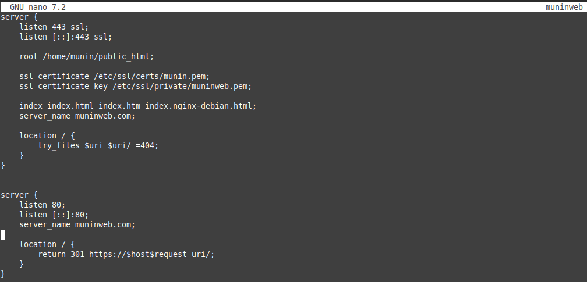

Ahora crearemos un enlace simbólico en la carpeta /etc/nginx/sites-enabled con el comando `sudo ln -s /etc/nginx/sites-available/huginweb /etc/nginx/sites-enabled/huginweb`. Después comprobamos el archivo de configuración con `sudo nginx -t`.

## Comprobación de los Hosts Virtuales

Se comprobará que los hosts virtuales están funcionando correctamente. Para ello añadiremos las direcciones IP de los hosts virtuales en el archivo /etc/hosts.

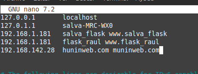

## Comprobación de Funcionamiento de los Hosts Virtuales

Ahora intentamos acceder a las páginas web de los usuarios desde un navegador.

La página funcionando correctamente.

Para el otro usuario, haremos lo mismo.

